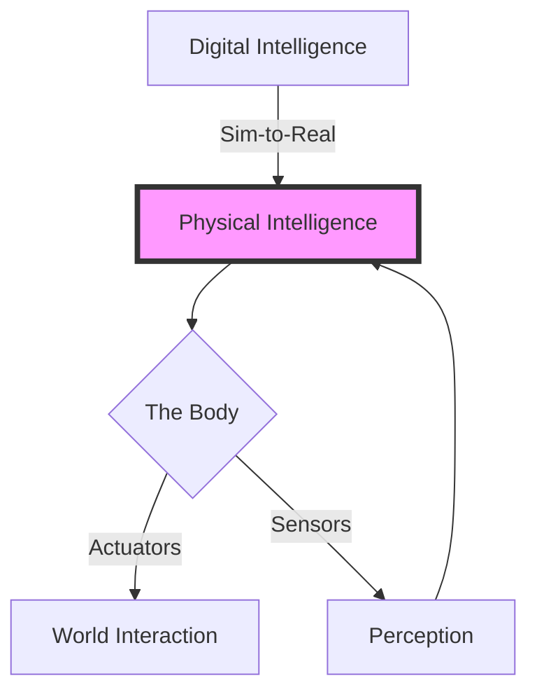

import Tabs from '@theme/Tabs';
import TabItem from '@theme/TabItem';
import Mermaid from '@theme/Mermaid';

# Week 1: Foundations of Physical AI

## The Embodiment Hypothesis
**Physical AI** refers to the synthesis of Artificial Intelligence with physical systems. Unlike Large Language Models (LLMs) that live in the "ethereal" digital space, Physical AI agents must negotiate with the immutable laws of physics: gravity, friction, and inertia.

> **"Intelligence cannot exist without a body."** — *Rodney Brooks (MIT)*

This hypothesis suggests that true general intelligence requires sensorimotor interaction. A model that has never felt "heavy" cannot impactfuly reason about moving a piano.

### The Humanoid Form Factor
Why are we seeing a surge in Humanoids (Tesla Optimus, Figure 01, Unitree H1)?
- **Infrastructure Compatibility**: Our stairs, door handles, and tools are designed for bipeds with two hands.
- **Data Availability**: YouTube is full of humans doing things (Ego-Centric Data), which provides a massive training set for imitation.



## Lab 1: Establishing the Forge

Robotics development is notoriously difficult to set up. We will support **Linux (Native)**, **Windows (WSL2)**, and **macOS** where possible.

### Prerequisites
*   **Linux**: Ubuntu 22.04 LTS (Standard)
*   **Windows**: Windows 10/11 with WSL2 enabled.
*   **Mac**: Apple Silicon (M1/M2/M3) - *Note: GPU Simulation support is limited on Mac.*

### Step 1: System Preparation

<Tabs>
  <TabItem value="linux" label="🐧 Ubuntu 22.04" default>

  Isolate your environment using Docker to prevent breaking your system Python.

  ```bash
  # 1. Update and Install Essentials
  sudo apt update && sudo apt install -y curl git build-essential

  # 2. Install Docker
  curl -fsSL https://get.docker.com -o get-docker.sh
  sudo sh get-docker.sh
  
  # 3. NVIDIA Container Toolkit (CRITICAL for Sim)
  curl -fsSL https://nvidia.github.io/libnvidia-container/gpgkey | sudo gpg --dearmor -o /usr/share/keyrings/nvidia-container-toolkit-keyring.gpg
  sudo apt-get install -y nvidia-container-toolkit
  sudo nvidia-ctk runtime configure --runtime=docker
  sudo systemctl restart docker
  ```

  </TabItem>
  <TabItem value="windows" label="🪟 Windows (WSL2)">

  Robotics on Windows works best via **WSL2 (Windows Subsystem for Linux)**.

  1.  Open PowerShell as Administrator:
      ```powershell
      wsl --install
      ```
  2.  Reboot your machine.
  3.  Install **Docker Desktop for Windows**.
  4.  Go to **Docker Settings** -> **Resources** -> **WSL Integration** -> Enable for "Ubuntu".

  **Verified Stack**: NVIDIA Drivers on Windows pass-through to WSL2 automatically!

  </TabItem>
  <TabItem value="mac" label="🍎 macOS">

  *Warning: High-fidelity Physics Simulators (Isaac Sim) do NOT run on macOS. You will rely on MuJoCo.*

  ```bash
  # Install Homebrew
  /bin/bash -c "$(curl -fsSL https://raw.githubusercontent.com/Homebrew/install/HEAD/install.sh)"

  # Install ROS 2 (RoboStack is recommended for Mac)
  conda install -c conda-forge ros-humble-desktop
  ```

  </TabItem>
</Tabs>

### Step 2: Verification

Let's ensure your GPU is accessible for training neural networks.

```python title="test_gpu.py"
import torch
print(f"CUDA Available: {torch.cuda.is_available()}")
print(f"Device Name: {torch.cuda.get_device_name(0)}")
```

