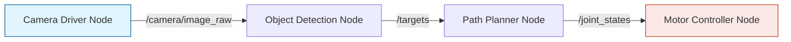

# Week 2: ROS 2 Basics

## Introduction to ROS 2

**ROS 2 (Robot Operating System 2)** is the industry standard middleware for robotics. Unlike ROS 1, which relied on a custom master node, ROS 2 is built on top of **DDS (Data Distribution Service)**, making it more real-time capable and decentralized.

### Core Concepts
ROS 2 is a graph-based system.



#### Nodes
A **Node** is a process that performs computation. A robot system is typically comprised of many nodes.

#### Topics (Publish/Subscribe)
Nodes exchange data over **Topics**. This decouples the system. The *Camera* doesn't know who is listening, it just shouts data.
*   **Publisher**: Sends data.
*   **Subscriber**: Receives data.

#### Services
For synchronous request/response interactions (e.g., "Take a picture now"), use **Services**.

## Lab: Creating a Custom ROS 2 Node

We will create a simple "Talker" node in Python.

### Step 1: Create a Workspace
```bash
mkdir -p ~/ros2_ws/src
cd ~/ros2_ws/src
```

### Step 2: Create a Package
```bash
ros2 pkg create --build-type ament_python my_first_package
```

### Step 3: Write the Node
Edit `~/ros2_ws/src/my_first_package/my_first_package/simple_publisher.py`:

```python
import rclpy
from rclpy.node import Node
from std_msgs.msg import String

class SimplePublisher(Node):
    def __init__(self):
        super().__init__('simple_publisher')
        self.publisher_ = self.create_publisher(String, 'topic', 10)
        timer_period = 0.5  # seconds
        self.timer = self.create_timer(timer_period, self.timer_callback)
        self.i = 0

    def timer_callback(self):
        msg = String()
        msg.data = 'Hello Physical AI: %d' % self.i
        self.publisher_.publish(msg)
        self.get_logger().info('Publishing: "%s"' % msg.data)
        self.i += 1

def main(args=None):
    rclpy.init(args=args)
    minimal_publisher = SimplePublisher()
    rclpy.spin(minimal_publisher)
    minimal_publisher.destroy_node()
    rclpy.shutdown()

if __name__ == '__main__':
    main()
```
