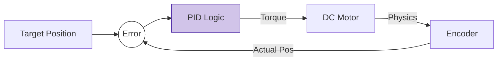

# Week 6: Classic Control Theory

## PID Control: The Bread and Butter

Despite the hype of AI, 95% of the world's motors are controlled by **PID (Proportional-Integral-Derivative)** controllers.



### The Control Law

To avoid MDX parsing issues with LaTeX variables, the Control Law is represented here in plain logic:

> **Output = P + I + D**

Where:
*   **P (Proportional)**: $K_p \times Error$ (Push harder if error is large)
*   **I (Integral)**: $K_i \times \sum Error$ (Push harder if error persists)
*   **D (Derivative)**: $K_d \times \Delta Error$ (Push less if closing gap fast)

## Kinematics

### Forward Kinematics (FK)
*"Given joint angles, where is my hand?"*
This is easy trigonometry.

### Inverse Kinematics (IK)
*"I want my hand at (x, y, z), what should my joint angles be?"*
This is hard. It involves solving non-linear equations, often with multiple solutions (elbow up vs. elbow down).

## Lab: Inverse Kinematics with Pinocchio

**Pinocchio** is a fast rigid body dynamics library for Python/C++.

```python
import pinocchio as pin
import numpy as np

# Load the robot model (e.g., a UR5 arm)
urdf_path = "ur5.urdf"
model = pin.buildModelFromUrdf(urdf_path)
data = model.createData()

# Desired End Effector Position (SE3)
desired_position = np.array([0.5, 0.0, 0.5])

# Iterative IK (Jacobian Transpose method simplified)
q = pin.neutral(model) # Initial guess
eps = 1e-4
IT_MAX = 1000
dt = 1e-1
damp = 1e-12

for i in range(IT_MAX):
    pin.framesForwardKinematics(model, data, q)
    # Error calculation and update steps would go here
    # J = pin.computeFrameJacobian(...)
    # v = - J.T.dot(error)
    # q = pin.integrate(model, q, v * dt)
    pass
    
print("Solved Joint Angles:", q)
```

:::warning Jacobian Singularities
At certain configurations (like an arm fully extended), the robot loses a degree of freedom. The Jacobian becomes singular (determinant is 0), and IK solvers can explode with infinite velocities.
:::
